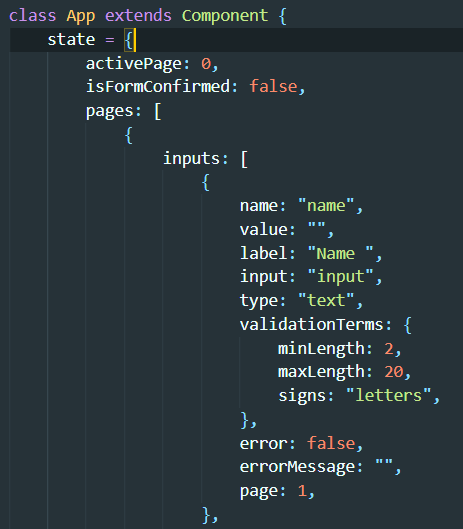

# Form Validator created in React

This is a form validator created to train my programming skills in SCSS, JavaScript and React.

## Running

After you clone it from GitHub to your local folder.
To download node modules, use:

```
"npm install"
```

To open http://localhost:3000 to view it in the browser, use:

```
"npm start"
```

## Form Validator pages

Each page is created through App.js.
Inside state there is "pages" array that includes objects with "inputs" array inside them.
Depends on "activePage" number, the Page.js gets the specific "pages" array and create a page based on inputs inside this array.



## Form Validator inputs

The form validator inputs types:

-   input
    -   text
    -   date
    -   password
-   select

Each "TextInput" input got a validation terms. It specify which kind of sign can be used inside input and how many of those signs can be used.
Some of the inputs can have some personalised validation terms.

## Form Validation

To validate the form/page each input has to be filled or choosen.
If validation terms aren't achieved, the "error message" is shown under the input.

## Summary Page

After the form has been filled the summary page is shown. 
The user can check if he/she filled everything correctly. 
After accepted the form, the "Thanking Message" is shown and after 3 seconds the form is cleaned up and first page is shown. 
If "decline" button is clicked the form is back to first page and the user can change his/her's responses. 
